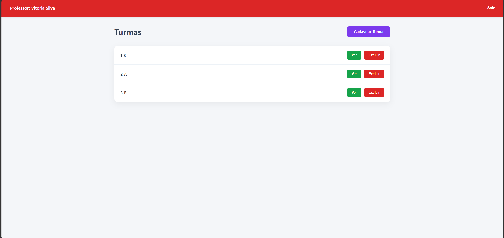
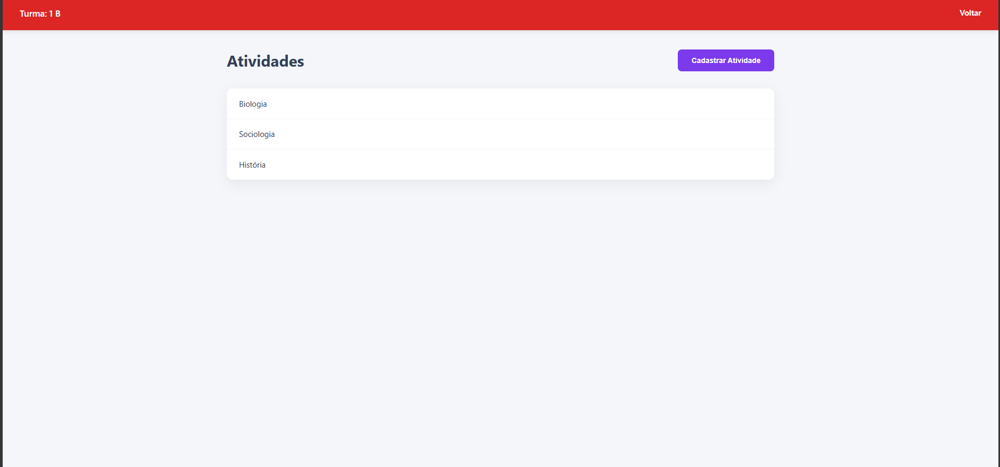

# Sistema Escolar - Projeto Full Stack

## Descrição do Sistema

Este sistema foi desenvolvido com o objetivo de permitir o gerenciamento de turmas e atividades por professores.

O sistema realiza autenticação simples de usuários (professores) e permite operações de cadastro, listagem e exclusão de turmas e atividades.

---

## Requisitos de Infraestrutura

### Editor de Código (IDE)
- Visual Studio Code (VS Code)

### Banco de Dados (SGBD)
- MySQL 
- Utilizado via XAMPP (Apache + MySQL)

### Servidor de Aplicação
- Node.js v18 ou superior
- Express.js

### Linguagens Utilizadas
- JavaScript 
- HTML
- CSS

---

## Prints das Telas

### Tela de Login

---

### Cadastro de Turmas

---

### Cadastro de Atividades

